# 安卓平台启动器后台说明

::: warning 人力有时穷，技术有时限
本篇内容可能有效，可能无效，可能对某些版本有效，可能对某些负载下有效，  
我们无法像某购物平台那样侵入安卓系统，只能在规则限定内尽力提供帮助。

下面一些情况可能导致本文提供的方法无效：

- 系统版本过低：低版本厂商定制系统普遍有更多的电池优化设置藏在边边角角，需要您自己去探索
- 省电模式：打开省电模式后可能会限制应用后台运行
- 长时间锁屏：长时间锁屏后系统可能会自动省电，您可以考虑打开“充电时屏幕不休眠”等设置

**我们不推荐您在需要长期稳定性的场景下使用安卓手机设备作为服务器。**
:::

安卓平台启动器因为系统限制，可能出现切到后台/锁屏后无法正常工作，再次打开应用时出现日志 "网络波动导致数据连接断开"。

此时我们需要在系统设置中设置允许应用后台运行。

通常来说，您可以在启动器中找到 “申请电池优化豁免” 按钮，点击后即可直接允许应用后台运行：

如果设置无效，您可以尝试下面的方法手动设置。

## 手动设置方法

除华为外，手动设置方法可以总结为：进入应用设置，打开电池/耗电设定，设置为允许应用后台运行。

下面为通常会提出这个问题的手机系统用户提供设置方法参考：

::::: tabs

@tab 小米 {#xiaomi}

演示系统版本：HyperOS 1.0.13.0，其他版本可能略有不同，请根据实际情况操作。

1. 长按应用图标，进入应用信息

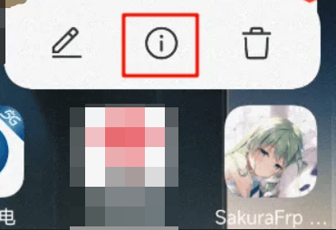

1. 进入 “省电策略”

1. 选择 “无限制”

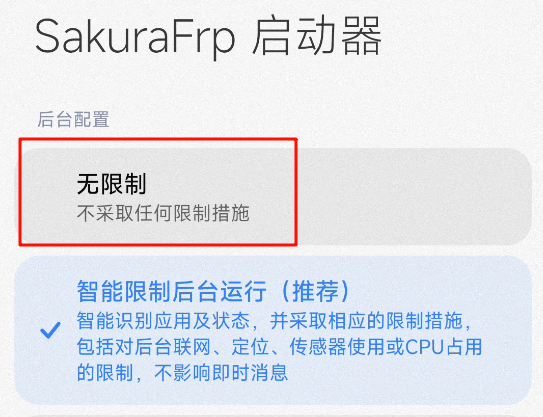

@tab OPPO {#oppo}

演示系统版本：ColorOS 14，其他版本可能略有不同，请根据实际情况操作。

1. 长按应用图标，进入应用详情

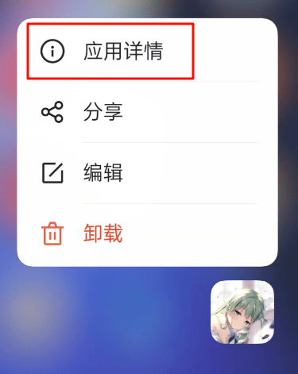

1. 进入 “耗电管理”

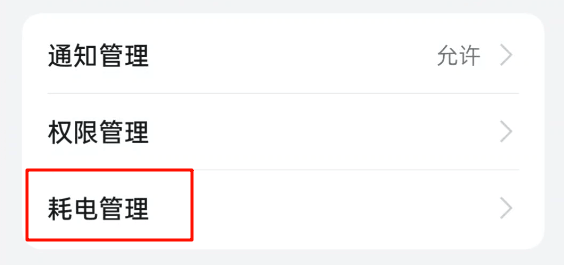

1. 启用 “允许完全后台行为”

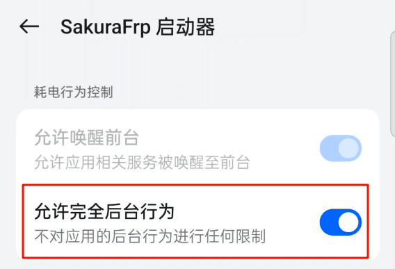

@tab VIVO {#vivo}

1. 长按应用图标，进入应用信息

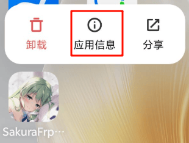

1. 进入 “电量”

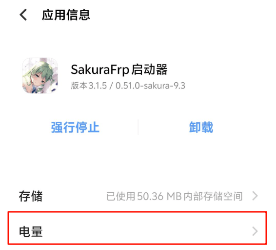

1. 进入 “后台耗电管理”

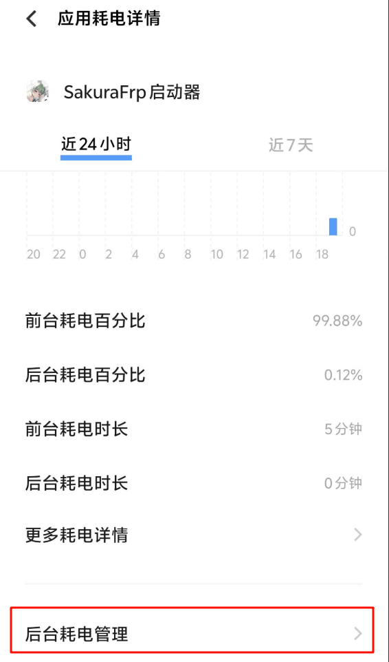

1. 选择 “允许后台高耗电”

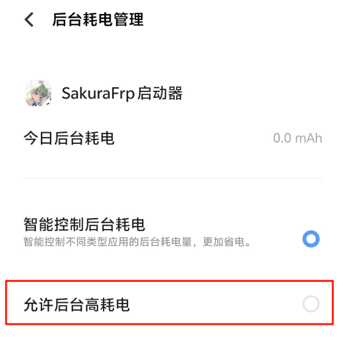

@tab 华为（非 NEXT） {#huawei}

演示系统版本：HarmonyOS 4.2，其他版本可能略有不同，请根据实际情况操作。

华为在系统中删除了便捷进入应用设置的入口，同时将设置分散到了整个“设置”应用中，  
下面我们会尝试提供一个设置方法，但我们并不确定一个设置是否总会有用。

1. 打开设置，进入 “电池”

1. 下滑菜单，找到 “SakuraFrp 启动器”

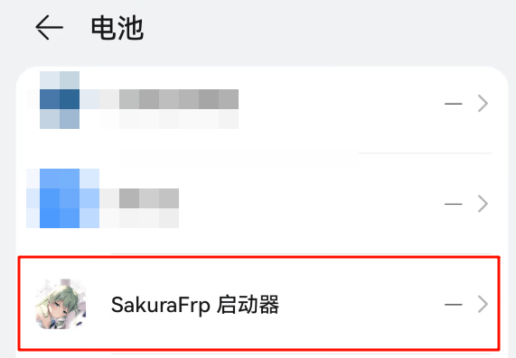

1. 选择 “启动管理”

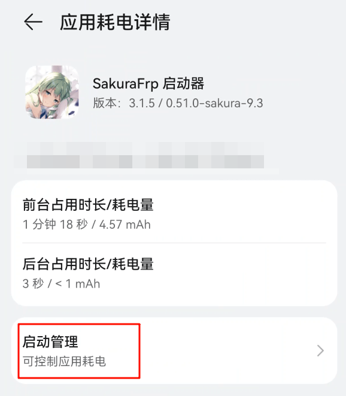

1. 在弹窗中关闭 “自动管理” 开关，然后打开 “允许后台活动” 开关

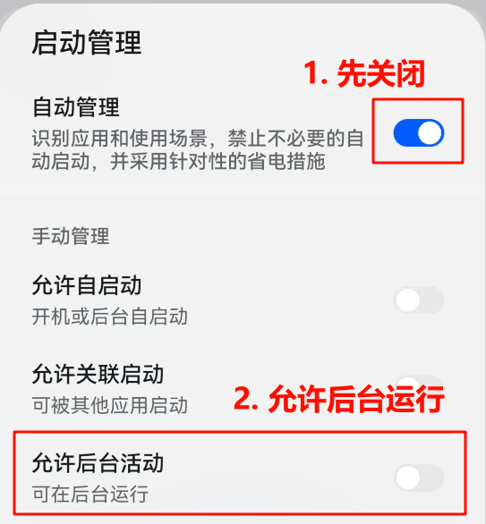

@tab 三星 {#samsung}

演示系统版本：One UI 6.1，其他版本可能略有不同，请根据实际情况操作。

1. 长按应用图标，进入应用信息

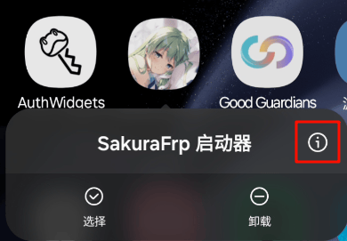

1. 进入 “电池”

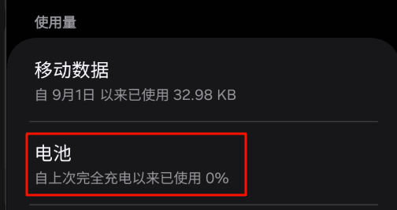

1. 选择 “不受限制”

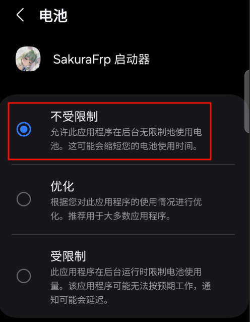

:::::
